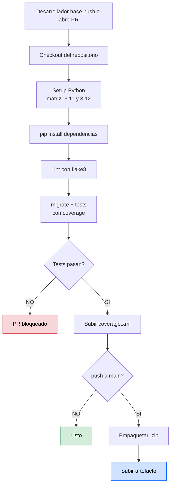

# Diagrama del flujo de integracion continua (CI)

```mermaid
flowchart TD
    A[Desarrollador hace push o abre PR] --> B[Checkout del repositorio]
    B --> C[Setup Python<br/>matriz: 3.11 y 3.12]
    C --> D[pip install dependencias]
    D --> E[Lint con flake8]
    E --> F[migrate + tests<br/>con coverage]
    F --> G{Tests pasan?}
    G -->|NO| H[PR bloqueado]
    G -->|SI| I[Subir coverage.xml]
    I --> J{push a main?}
    J -->|NO| K[Listo]
    J -->|SI| L[Empaquetar .zip]
    L --> M[Subir artefacto]

    style H fill:#f8d7da,stroke:#dc3545,color:#000
    style K fill:#d4edda,stroke:#198754,color:#000
    style M fill:#cfe2ff,stroke:#0d6efd,color:#000
```
