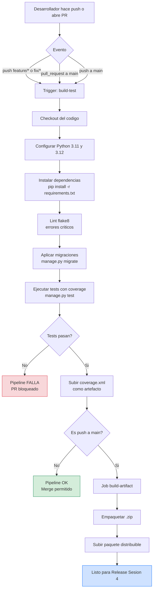

# Sesion 3 - Construccion e Integracion del Sistema (CI/CD)

## Actividad 1: Herramienta de construccion automatizada

Se selecciono **GitHub Actions** como plataforma de integracion continua por:

- Integracion nativa con el repositorio (sin servidor adicional)
- Gratuito para repositorios publicos
- Sintaxis YAML declarativa
- Soporte para matriz de versiones (probar en multiples versiones de Python)
- Marketplace con miles de acciones reutilizables

El workflow vive en [.github/workflows/ci.yml](../.github/workflows/ci.yml).

## Actividad 2: Pipeline configurado

### Disparadores (triggers)

```yaml
on:
  push:
    branches: [main, develop, "feature/**", "fix/**"]
  pull_request:
    branches: [main]
  workflow_dispatch:   # ejecucion manual
```

El pipeline se ejecuta en:
- Cada push a `main`, `develop` o cualquier rama `feature/*` / `fix/*`
- Cada Pull Request hacia `main`
- Bajo demanda desde la interfaz de GitHub

### Job 1: `build-test`

| Paso | Accion | Proposito |
|------|--------|-----------|
| 1 | `actions/checkout@v4` | Descarga el codigo del commit |
| 2 | `actions/setup-python@v5` | Configura Python 3.11 y 3.12 (matriz) |
| 3 | `pip install -r requirements.txt` | Instala dependencias |
| 4 | `flake8` | Verifica errores criticos de sintaxis |
| 5 | `manage.py migrate` | Aplica migraciones para validar modelos |
| 6 | `coverage run manage.py test` | Ejecuta toda la suite con medicion de cobertura |
| 7 | `coverage report` + `coverage xml` | Genera reporte legible y XML |
| 8 | `actions/upload-artifact@v4` | Sube el `coverage.xml` como artefacto |
| 9 | `manage.py check --deploy` | Verificacion de configuracion |

### Job 2: `build-artifact`

Se ejecuta solo cuando se hace push a `main` y depende de que `build-test` pase.

| Paso | Accion |
|------|--------|
| 1 | Checkout del codigo |
| 2 | Empaqueta el proyecto en un `.zip` (excluyendo `venv`, `.git`, `__pycache__`, `*.sqlite3`) |
| 3 | Sube el `.zip` como artefacto descargable de la ejecucion |

## Diagrama de flujo de integracion



### Diagrama simplificado en ASCII

```
   ┌────────────────────┐
   │  push  /  pull req │
   └─────────┬──────────┘
             │
             ▼
   ┌────────────────────┐
   │   checkout codigo  │
   └─────────┬──────────┘
             │
             ▼
   ┌────────────────────┐
   │  setup Python 3.x  │  matriz: 3.11, 3.12
   └─────────┬──────────┘
             │
             ▼
   ┌────────────────────┐
   │ pip install deps   │
   └─────────┬──────────┘
             │
             ▼
   ┌────────────────────┐
   │   lint  (flake8)   │
   └─────────┬──────────┘
             │
             ▼
   ┌────────────────────┐
   │ migrate + test     │  con coverage
   └─────────┬──────────┘
             │
             ▼
   ┌────────────────────┐    ┌───────────────────┐
   │ subir coverage.xml │    │ FALLA → bloquea PR│
   └─────────┬──────────┘    └───────────────────┘
             │
             ▼ (solo si rama = main)
   ┌────────────────────┐
   │ empaquetar .zip    │
   └─────────┬──────────┘
             │
             ▼
   ┌────────────────────┐
   │ artefacto listo    │ → Sesion 4 (Release)
   └────────────────────┘
```

## Pruebas automatizadas

La suite incluye **15 pruebas** distribuidas en 4 clases:

| Clase de tests | Cantidad | Que cubren |
|----------------|----------|------------|
| `EstudianteModelTests` | 2 | `__str__`, propiedad `nombre_completo` |
| `EstudianteCRUDViewsTests` | 4 | List, create, detail, delete |
| `BuscadorEstudiantesTests` | 3 | Busqueda por texto, filtro por carrera, vacio |
| `EstudianteFormValidationTests` | 5 | Validaciones de cedula, semestre y correo |
| `OrdenListadoTests` | 1 | Orden alfabetico en listado |
| **Total** | **15** | |

### Ejecucion local

```powershell
./venv/Scripts/python manage.py test estudiantes -v 2
```

### Ejecucion con cobertura

```powershell
./venv/Scripts/python -m pip install coverage
./venv/Scripts/python -m coverage run --source='estudiantes' manage.py test
./venv/Scripts/python -m coverage report
```

## Productos generados por el pipeline

1. **`coverage-report-py3.11`** y **`coverage-report-py3.12`**: reportes XML de cobertura por version de Python
2. **`pdldtla-build-<sha>`**: ZIP distribuible del proyecto (solo en pushes a `main`)
3. **Logs de ejecucion**: visibles en la pestania *Actions* del repositorio

## Buenas practicas aplicadas

- **Matriz de versiones**: evita "funciona en mi maquina" probando dos versiones de Python.
- **Cache de pip**: acelera la ejecucion del pipeline (`cache: "pip"`).
- **`if: always()` en upload**: el reporte de cobertura se sube aunque fallen los tests, util para diagnostico.
- **Fail-fast desactivado**: si una version de Python falla, la otra continua para dar mas info al desarrollador.
- **Permisos minimos**: el workflow solo lee el repo y escribe artefactos (no usa secrets ni hace deploy).
